# markcut — Markdown-to-Video Engine

Write a storyboard in markdown, get a rendered video with TTS narration and subtitles.

```bash
# Render a storyboard to MP4
npx markcut render storyboard.md

# Preview with live edit (edit .md file, player auto-reloads)
npx markcut preview storyboard.md --edit

# Label clips in a stream tree
npx markcut preview labels.json --label --port=3031
```

## How it works

```
storyboard.md  ──[parse]──▶  DescriptiveRoot  ──[compile]──▶  Stream Tree  ──[Remotion]──▶  MP4
                                  │                                  │
                             resolveMediaDurations()             <Sequence>
                             resolveScripts() → TTS              <Series>
                             resolveSubtitles() → VTT            , <OffthreadVideo>
```

1. **Write** a storyboard in markdown (scenes with `## headings`, media with `-` bullets)
2. **Parse** the markdown into a descriptive tree
3. **Resolve** media durations (ffprobe), generate TTS narration (edge-tts), transcribe to VTT (whisper)
4. **Compile** the descriptive tree into a stream tree (the low-level Remotion JSON)
5. **Render** with Remotion — no React code needed

## Features

| Feature | Description |
|---|---|
| **Markdown input** | Write `## Scene` headings, `- bullet` leaves. Components via `jsx:"<Tag />"` syntax |
| **JS imports block** | `` ```js imports `` code fence with real ESM `import` statements instead of YAML |
| **Dynamic components** | Load any React component from npm, GitHub, or any URL via `import { X } from "pkg"` |
| **Tween animation** | `tween(from, to)` function calls in JSX for frame-accurate numeric animation |
| **Compiled input** | Pre-compiled stream tree for direct Remotion rendering |
| **TTS narration** | `script` field → edge-tts CLI → WAV audio. Configurable engine (mlx-audio, custom) |
| **STT subtitles** | TTS audio → whisper → VTT → root subtitle overlay with animated caption types (typewriter, fade, bounce, etc.) |
| **Tween animation** | `tween(from, to)` function calls in JSX for frame-accurate numeric animation |
| **Styling** | Inline `style` strings on any node for CSS. JSX components use inline React styles |
| **Live edit** | `--edit` watches the input file, re-runs pipeline, auto-reloads player |
| **Label mode** | `--label` interactive player with per-scene label input, saves to labels.json |
| **CLI** | `render`, `preview` commands for MP4 export and Remotion Studio |
| **Programmatic** | `MarkCut` / `DescriptiveComposition` React components for embedding |

## Example

```md
# video
width:1080 height:1920 fps:30 layout:series

## Hook
layout:parallel script:"Set the mood with a beautiful landscape"
- image src:cover.jpg duration:3

## Features
layout:transitionSeries transition:fade transitionTime:0.4 script:"Show what we built"
- component duration:6 jsx:"<DeviceMockup src='screenshot.png' />"
- component duration:4 jsx:"<StatCounter value={100} suffix='K' label='Users' />"
```

Components are registered via frontmatter `imports:` or a `` ```js imports `` code block:

````
```js imports
import { DeviceMockup } from "mockup-component"
import { StatCounter } from "stat-counter"

// Inline component definition
export function Greeting({ name }) {
  return <h1 style={{color: '#fff'}}>Hello {name}</h1>;
}
```
````

### Dynamic Components

Any React component from npm, GitHub, or any URL can be imported and used directly in JSX expressions. The engine loads them at render time via esm.sh — no build step required.

```markdown
- component duration:3 jsx:"<PieChart data={[{value:40,color:'#E38627'}]} />"
```

Inline components can be defined entirely in the imports block using `export function`, making the video self-contained with no external files.

## Docs

| Document | What it covers |
|---|---|
| [docs/markdown-strict-descriptive.md](docs/markdown-strict-descriptive.md) | Markdown descriptive syntax reference |


## Variants

Create different versions of the same video for different platforms, languages, or formats using **variant sections** in your markdown.

### Defining Variants

Add `# variant-name` headings alongside `# video` (the base). Each variant can override any property using variant-prefixed keys:

```markdown
# video
width:1080 height:1920 fps:30 layout:series

## Intro
layout:parallel
- component duration:3 jsx:"<h1>Hello</h1>"
- image src:default.jpg duration:3

# zh
## Intro
layout:parallel
- component duration:3 zh:"<h1>你好</h1>"         ← bare key overrides jsx (primary content)
- image zh-src:zh-image.jpg src:default.jpg       ← zh-src overrides src

# youtube
width:1920 height:1080 fps:30                     ← different aspect ratio
## Intro
layout:parallel
- component duration:3 jsx:"<h1>YouTube Hello</h1>"
```

Two override mechanisms:
- **Variant-prefixed keys**: `zh-src` → `src`, `zh-jsx` → `jsx`, `zh-script` → `script`
- **Bare variant keys**: `zh:"<h1>你好</h1>"` replaces the node's primary content key (`jsx` for components, `src` for images/video, `script` for audio)

### Multi-Variant Preview Server

The `preview` command accepts multiple `--variant` flags, each defining a separate compilation target. Variants are compiled **sequentially** (not in parallel) to avoid resource contention from CLI tools like whisper and ffprobe.

```bash
# Preview 4 variants simultaneously
npx markcut preview storyboard.md \
  --variant default \
  --variant zh-tiktok \
  --variant en-tiktok \
  --variant youtube

# Each variant is served at its own URL:
#   http://localhost:3001            → default
#   http://localhost:3001/zh-tiktok  → zh + tiktok chain
#   http://localhost:3001/en-tiktok  → en + tiktok chain
#   http://localhost:3001/youtube    → youtube
```

Compound variant labels (like `zh-tiktok`) are split on `-` to form a **variant chain** — the parser applies `zh` overrides first, then `tiktok` overrides on top. Each variant gets its own compiled output and subtitle directory. Component bundles are stored in a shared cache (`.markcut/generated/components/`) — identical imports across variants reuse the same bundle.

### Variant-Aware Browser

The browser player reads `window.VARIANT` from the URL path and fetches the correct compiled data via `/api/video-data?variant=<name>`. A **variant switcher bar** at the top of the player lets you jump between variants instantly.

## `.markcut/` Directory Layout

When you run `preview` or `render`, all generated artifacts live under `.markcut/` next to the source file. With multiple variants, each gets its own subdirectory:

```
.markcut/
  generated/                    ← shared, content-addressed (across all variants & files)
    tts/                        ← TTS narration audio (content-hash filenames)
    media/                      ← TTI/TTV media (content-hash filenames)
    includes/                   ← compiled sub-video JSON (content-hash)
    components/                 ← component bundles (content-hash, shared across variants)
  <basename>/                   ← per-source-file
    default/                    ← default variant artifacts
      compiled.json             ← compiled stream tree
      subtitles.vtt
    zh-tiktok/                  ← variant-specific artifacts
      compiled.json
      subtitles.vtt
    youtube/
      compiled.json
      subtitles.vtt
```

- **`generated/`** — shared artifacts using content-hash filenames, so identical scripts/prompts across different variants reuse the same cached file
- **`generated/components/`** — component bundles shared across all variants and source files. Identical imports produce the same content hash, so variants with the same component registrations reuse the same bundle
- **`<basename>/<variant>/compiled.json`** — the compiled stream tree for each variant, cached to disk for fast restarts
- The server serves `.markcut/` as a document root, so components at `.markcut/generated/components/abc.js` are served as `/generated/components/abc.js`

The `.markcut/` directory is gitignored by default — it's regenerated on each run.

## Architecture

```
src/
├── entry.tsx              ← Library entry: MarkCut + DescriptiveComposition
├── index.ts               ← Remotion registerRoot (for studio/render CLI)
├── Root.tsx               ← Remotion Composition wrapper
├── schema/                ← Zod schemas for all stream types
├── types/                 ← React renderers (Folder, Video, Image, Audio, etc.)
├── descriptive/           ← Compiler, markdown parser, resolve pipeline
├── themes/                ← Theme presets + ThemeProvider
├── render/
│   ├── cli.mjs            ← CLI entry point
│   └── tts.ts             ← TTS via CLI template + variable substitution
├── player/
│   ├── server.mjs         ← Unified server (--edit, --label, preview)
│   ├── components/        ← React control components for all modes
│   │   ├── index.ts
│   │   ├── EditControls.tsx
│   │   ├── LabelControls.tsx
│   │   └── VariantBar.tsx
│   ├── pipeline.ts        ← Pipeline entry (bundled to pipeline.mjs)
│   └── browser.tsx        ← Browser player (React, bundled to player.js)
├── utils/                 ← Duration calc, VTT parser, helpers
└── tests/                 ← Vitest integration tests
```

## Scripts

```bash
npm run render      # render a JSON stream tree to MP4
npm run preview     # open Remotion Studio
npm run vision      # analyze images/videos in a folder (metadata + AI perception)
npm run typecheck   # TypeScript type check
npm test            # run unit + integration tests
```

## Vision Pipeline

```bash
# Full pipeline: extract metadata → normalize → AI perception (images & videos)
npx markcut vision <folder>

# With interactive labeling step before AI
npx markcut vision <folder> --label

# Provide context about people/places
npx markcut vision <folder> --instruct "the girl is Maggie, the man in red is me"
```



```mermaid
flowchart LR
    subgraph Input[Input]
        A[Media Folder<br/>images + videos]
    end

    subgraph Metadata["1. Metadata Extraction"]
        B[exiftool / ffprobe]
        C[metadata.json<br/>width, height, created,<br/>GPS location, duration]
    end

    subgraph Normalize["2. Normalization"]
        D[ffmpeg resize<br/>images → 384px<br/>videos → 360p]
    end

    subgraph Label["Optional: Labeling"]
        E[Build preview tree<br/>with seed]
        F[Label preview server<br/>user annotates scenes]
        G[Merge labels → userHints<br/>into metadata.json]
    end

    subgraph Image["3. Image Perception"]
        H[ITT: image-to-text<br/>mlx-vlm model]
        I[Perception saved:<br/>description]
    end

    subgraph Video["4. Video Understanding"]
        J[VTT: video-to-text<br/>mlx-vlm model]
        K[STT: speech-to-text<br/>whisper]
        L[VTT→ overall desc]
        M[STT → VTT subtitles]
        N[Build merged segment<br/>boundaries]
        O[LLM merges boundaries<br/>into final segments]
        P[Per-segment vision<br/>clip extraction + ITT]
    end

    subgraph Output[Output]
        Q[metadata.json<br/>with perception desc,<br/>subtitles & segments]
    end

    A --> B --> C --> D
    D --> Image
    D --> Video
    C -.->|--label| E --> F --> G --> D
    Image --> H --> I --> Q
    Video --> J --> L
    Video --> K --> M
    L --> N
    M --> N
    N --> O --> P --> Q

    style Input fill:#1a1a2e,stroke:#16213e,color:#fff
    style Metadata fill:#0f3460,stroke:#16213e,color:#fff
    style Normalize fill:#533483,stroke:#16213e,color:#fff
    style Label fill:#e94560,stroke:#16213e,color:#fff
    style Image fill:#0f3460,stroke:#16213e,color:#fff
    style Video fill:#0f3460,stroke:#16213e,color:#fff
    style Output fill:#1a1a2e,stroke:#16213e,color:#fff
```

### Vision CLI Options

| Option | Description |
|---|---|
| `--label` | Add interactive labeling step before AI pipeline (opens browser preview) |
| `--instruct "text"` | Background context about people/places (injected into AI prompts) |
| `--prompts-file <path>` | Custom prompts markdown file (default: `src/vision/vision_prompts.md`) |
| `--vtt-sample-interval <n>` | Sample one video frame every N seconds for VTT (default: 5) |
| `--pick <files>` | Comma-separated filenames to process (skip others) |
| `--skip-stt` | Skip speech-to-text for videos |
| `--dry-run` | Show what would be processed without running AI |
| `--show-prompts` | Print the prompts template file and exit |

## Architecture
