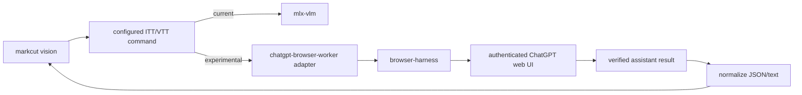
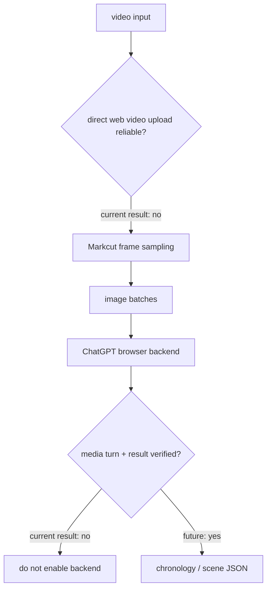
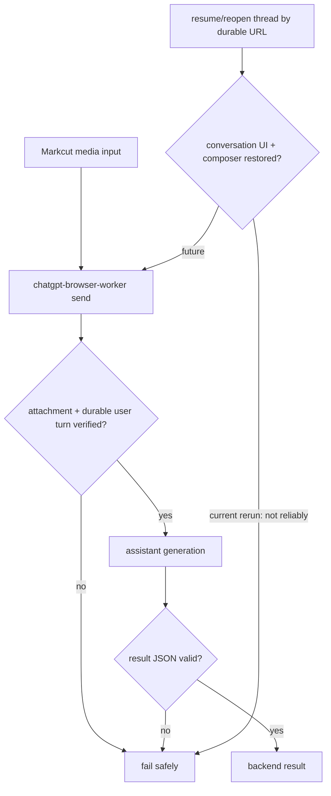

# ChatGPT Browser Harness as a Markcut Vision Backend

Date: 2026-09-19
PR: #3
Recommendation: **not currently viable**

## Objective

Evaluate whether Markcut's configurable Vision CLI can use an authenticated ChatGPT web session, operated through the `chatgpt-browser-worker` skill and `browser-harness`, as an image/video understanding backend without using the ChatGPT API or the legacy MacDeveloperBridge Chrome/token path.

## Existing Markcut seam

Markcut already has a narrow backend seam in `src/config.mjs`:

- `DEFAULT_ITT_CLI` for image-to-text
- `DEFAULT_VTT_CLI` for video-to-text
- `DEFAULT_AGENT_CLI` for downstream agent work

The Vision CLI substitutes `{prompt}` and `{input}` into these command templates, so a future browser-backed backend does not require rewriting the Vision pipeline. The correct integration shape would be a small executable command that accepts the same prompt/input contract and emits normalized text/JSON on stdout.



## Browser-worker path tested

The experiment used the `chatgpt-browser-worker` contract from the Agents Relay worktree. The worker uses `browser-harness` as the only browser interaction layer and preserves ChatGPT thread identity and Project identity.

Observed worker thread:

- Project: `agents-relay`
- Thread: `6aaf32d4-4164-83ea-860a-c2453ce57e51`
- Requested thinking: `high`
- Effective thinking: `unknown` (UI could not verify it; no inference was made)

A second experiment targeted the existing `markcut` ChatGPT Project. The helper selected the Project, but current ChatGPT UI drift prevented its create helper from reliably observing/sending the composer without manual self-healing.

## Synthetic fixtures

To avoid private media and make correctness objectively measurable, the test generated:

1. `image-test-unique.png`
   - red rectangle
   - blue circle
   - green triangle
   - visible text identifying all three shapes and a unique fixture label
2. `video-test.mp4`
   - 6 seconds total
   - 0-2s red phase
   - 2-4s blue phase
   - 4-6s green phase

Fixtures were generated locally and kept out of Git.

## Control: existing Markcut image backend

The current configured image backend was run directly with the same image fixture using the existing `mlx-vlm`/MiniCPM path.

Observed runtime: approximately 8 seconds.

Observed result correctly identified:

- red rectangle
- blue circle
- green triangle
- `RED RECTANGLE | BLUE CIRCLE | GREEN TRIANGLE`
- `MARKCUT VISION UNIQUE FIXTURE 2026-09-19`

This establishes that the fixture and current Markcut backend are functioning.

## ChatGPT image experiment

The Browser Harness path successfully:

- selected an authenticated ChatGPT Project;
- created and preserved a real ChatGPT thread id;
- uploaded an image into the composer;
- submitted a media-analysis prompt through the browser UI;
- observed assistant message ids from the actual ChatGPT DOM.

However, the result path was not reliable enough for a backend:

1. One submitted image turn produced a terminal-looking but truncated assistant message:

   `{"description":"A`

2. The existing `result` helper incorrectly considered that partial text stable/final because its generating-state detector did not match the current UI state.
3. A later image retry entered a persistent `Stop answering` state while the attachment and prompt remained in the composer and no durable new user turn was observed.
4. The current helper's composer logic also drifted from the current ChatGPT DOM. In the current UI, the visible composer is a `contenteditable` element while a separate textarea may coexist. The helper can fill the wrong semantic surface or fail to observe the send control.
5. Direct self-healing through fresh DOM observation could send ordinary text turns, but media-turn behavior was still inconsistent.

### Structured-output reliability

Result: **fail** for backend-grade use.

A Markcut backend needs deterministic success/failure signaling and complete output. A truncated JSON prefix that is misclassified as complete is unsafe because downstream parsing or cache persistence can accept corrupted evidence.

## Video experiment

Direct video upload was attempted as the preferred path. The experiment reached a second failure mode before a trustworthy model result could be obtained: after opening the `markcut` Project for a fresh direct-video test, the current helper/UI combination failed to observe the expected composer surface consistently.

Because image media submission was already non-deterministic and the direct-video setup could not produce a verified, repeatable turn, the experiment did **not** treat a frame-sampling fallback as proof that direct video upload works.

A frame-sampling fallback remains technically possible because Markcut already owns ffmpeg normalization/sampling and can present sampled images to a backend. But the browser-backed image transport itself must first become reliable.



## Failure modes observed

| Area | Observation | Impact |
| --- | --- | --- |
| Composer detection | Current UI exposes both contenteditable and textarea-like surfaces | helper may target the wrong composer |
| Send detection | helper could report no `Send prompt` even when manual re-observation later found a usable control | brittle create/continue lifecycle |
| Media upload | attachment preview can exist without a reliable submitted turn | no durable proof input reached model |
| Generating detection | partial result was considered final | corrupted JSON may be accepted |
| Result verification | stable DOM text alone is insufficient when streaming state is misdetected | false completion |
| Project page lifecycle | new Project chat can change composer state/URL after first send | helper assumptions stale |
| Video | direct video path was not repeatably driven to a verified result | no production evidence |

## Minimum changes required before re-benchmarking

1. **Fix semantic composer selection**
   - prefer the visible `contenteditable` composer by accessibility role/name;
   - reject ambiguous multiple composer surfaces;
   - verify typed text appears in the same visible surface before sending.

2. **Fix send verification**
   - re-observe the current send control after typing/upload;
   - after click, require a new user-turn node or other durable conversation evidence;
   - do not return `prompt_sent: true` from a click alone.

3. **Fix streaming/final-result verification**
   - do not infer completion only from absence of one historical stop selector;
   - require the assistant message text to remain stable across a longer interval and require the conversation to return to an input-ready state;
   - for structured output, parse the requested JSON before returning success.

4. **Add media-specific lifecycle states**
   - upload started
   - attachment observed
   - attachment ready
   - turn submitted
   - assistant started
   - assistant complete
   - output validated

5. **Add regression fixtures**
   - one small PNG
   - one short MP4
   - exact expected JSON fields
   - timeout/stuck-generation case
   - truncated-JSON case

6. **Only then add a Markcut adapter command**
   - keep it experimental and opt-in;
   - preserve the existing ITT/VTT CLI template boundary;
   - do not change the default backend.

## Proposed future adapter shape

If the browser worker is repaired, the narrowest Markcut integration remains a command adapter rather than changes throughout the Vision pipeline:

```text
markcut vision
  -> MARKCUT_ITT_CLI / MARKCUT_VTT_CLI
  -> chatgpt-browser-vision executable
  -> chatgpt-browser-worker typed lifecycle
  -> browser-harness
  -> verified JSON stdout
```

The adapter should be responsible for media upload, schema validation, retry/resume of the same ChatGPT thread, and non-zero exit on unverified/truncated output.

## Recommendation

**Not currently viable.**

The architectural seam is good and ChatGPT web Vision is reachable through the intended browser-harness stack, but the current `chatgpt-browser-worker` implementation does not yet provide backend-grade guarantees for media submission or final-result verification. The existing Markcut local Vision backend remains substantially more deterministic for this workflow.

Do not switch Markcut's default Vision backend. Repair and regression-test the browser worker first, then rerun this PR's image and video fixtures. Once image media turns are deterministic, evaluate video in this order:

1. direct MP4 upload;
2. Markcut-owned frame sampling if direct upload is unsupported or unstable;
3. compare output quality, JSON validity, p50/p95 latency, and retry rate against the existing backend.

## Commands/evidence

Control image command used:

```sh
uvx --from mlx-vlm mlx_vlm.generate \
  --model mlx-community/MiniCPM-V-4.6-bf16 \
  --max-tokens 512 \
  --prompt 'Describe this image precisely, including colored shapes and visible text. Return concise JSON.' \
  --image .tmp/pr3-vision/image-test-unique.png \
  --temperature 0.0 \
  --thinking-mode disabled
```

Browser path used the `chatgpt-browser-worker` skill plus `browser-harness`; no ChatGPT API call, copied cookie, or MacDeveloperBridge ChatGPT runtime was used.

## Re-benchmark after browser-worker attachment and tab-lifecycle fixes

A second pass was run after Neo main added verified attachment submission (`defe80d`) and operation-owned tab cleanup (`3b4331e`). This changed the result in two useful ways:

- attachment submission itself is now materially safer: a prior smoke run observed the requested filename, prompt text, a new durable user turn, and a real user message ID before reporting success;
- `result --expect-json` now rejects malformed/truncated assistant output instead of treating it as completed. A deliberately observed truncated response failed with `assistant result is not valid JSON`, which closes the false-completion path seen in the first pass;
- operation-owned tab cleanup was verified by comparing page targets before and after an operation that opened a temporary thread tab; the target sets were identical after return.

The re-benchmark also exposed a new blocking failure at the durable-thread boundary. Threads that are visible and usable when reached through the existing ChatGPT sidebar can load as a shell-only page when opened directly by their durable conversation URL in a fresh tab. In the observed failures, the URL and Project sidebar loaded, but the conversation had **0 visible user messages, 0 visible assistant messages, and 0 composer surfaces**. `operate_bh.py` therefore correctly failed with `ChatGPT composer was not observed` rather than sending into an ambiguous page.

This matters because the current worker contract reopens a durable thread by URL for `send`, `status`, and `result`. A Vision backend cannot be considered reliable if durable thread recovery depends on whether the ChatGPT SPA was entered through sidebar navigation versus direct URL navigation.

### Updated failure boundary



### Updated recommendation

The browser-worker changes fix two important defects from the first pass—attachment-submit evidence and structured-result validation—but PR #3 should still remain research-only. The remaining blocker is now narrower and clearer: **reliable durable-thread reopening / SPA recovery**. Until the worker can reopen the exact `thread_id` and observe the same conversation state independent of navigation path, direct image/video benchmarking cannot be considered repeatable enough for a Markcut backend.

The next browser-worker fix should therefore target thread reopening semantics: prefer semantic sidebar navigation to the exact observed thread when direct URL hydration yields an empty shell, verify the requested `thread_id` after navigation, and only then expose the composer or result operations. After that, rerun the same PNG and MP4 fixtures without changing Markcut itself.
