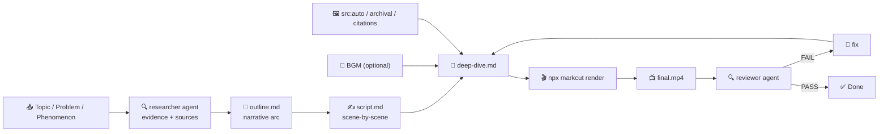

# Deep Dive (深度解读) Template

Follow this file top to bottom. Read the markcut skill (`SKILL.md` → `docs/markdown-descriptive.md`) first if you have not.



| Path | Runs in | Purpose |
|---|---|---|
| `TEMPLATE.md` | your context | everything |
| `prompts/*.md` | your context | fill-in prompts you execute |
| `agents/*.md` | separate session | subagent definitions |

## 0. Prerequisites

- `npx @lalalic/markcut` runnable
- `ffmpeg`/`ffprobe/exiftool` on PATH
- Web search capability (for research phase)
- ITT/TTV CLI (for `src:auto` visuals) — optional but recommended
- For reviewer: image-understanding capability, STT CLI

## 1. Inputs — collect before starting

| Input | Required | Default | Notes |
|---|---|---|---|
| Topic / problem / phenomenon | **yes** | — | what to analyze. Can be a question ("Why do democracies fail?"), a phenomenon ("The rise of remote work"), a problem ("Plastic pollution"), or a cultural object ("Oppenheimer") |
| Source material | no | — | optional: article URL, book title, research paper, documentary to reference |
| Language | no | en | narration language |
| Tone | no | `analytical` | `analytical` (neutral, evidence-driven), `opinionated` (strong thesis, persuasive), `philosophical` (open-ended, reflective), `investigative` (detective-like, reveals) |
| Target duration | no | 8 min | 3–20 min. Longer formats need deeper scene breakdown |
| Depth | no | `moderate` | `overview` (surface-level, broad), `moderate` (some depth, 3-5 angles), `deep` (thorough, 5-10 angles, academic-level) |
| Voice | no |  | mlx-audio voice per language |
| BGM style | no | `ambient` | background music mood. Optional — deep dives can work without BGM |

**Core rule: Every factual claim must be supported by a source.** If you cannot find a source for a claim, either qualify it ("some argue that...", "it's believed that...") or remove it. Cite sources on screen (see §3).

## 2. Scene grammar — narrative architecture

### The deep dive arc

A deep dive is not a lecture and not a highlight reel — it's a **narrative journey** through a topic. The canonical arc:

```
# video                          ← root: width:1920 height:1080 fps:30 layout:series
│                                  subtitle:{fontSize:"24px"}
│                                  transition:fade(0.5)
├── ## Hook                      ← 15–30s. The question, the contradiction, the mystery
├── ## Context                   ← 30–60s. Background the audience needs
├── ## Thesis                    ← 15–30s. Your central argument / framing
├── ## Angle 1                   ← 1–3 min. First perspective / evidence block
│   │                              (may contain multiple sub-scenes)
│   ├── {scene}                  ← Claim → Evidence → Source → Analysis
│   ├── {scene}                  ← Repeat for each sub-point
│   └── ...
├── ## Angle 2                   ← 1–3 min. Second perspective
├── ## Angle 3                   ← 1–3 min. (optional, depth-dependent)
├── ## Counterpoint              ← 30–60s. The opposing view (fairly stated)
├── ## Rebuttal / Synthesis      ← 30–60s. Why the counterpoint doesn't fully hold, or synthesis
└── ## Conclusion                ← 30–60s. Restate thesis, broader implication, call to reflection
```

### Scene timing template

| Section | Duration | Purpose |
|---|---|---|
| Hook | 15–30s | Arresting question, contradiction, or provocative claim. No context yet. |
| Context | 30–60s | Background: history, definitions, prior work. What the audience MUST know. |
| Thesis | 15–30s | Clear statement of your argument/framing. "I argue that..." |
| Angle×N | 1–3 min each | Evidence blocks. Each angle = one perspective or dimension of the topic |
| Counterpoint | 30–60s | Fair presentation of the strongest opposing view |
| Synthesis | 30–60s | Why the evidence points your way, or a nuanced middle ground |
| Conclusion | 30–60s | Broader implication, call to reflection, closing thought |

### Scene types (within sections)

Each section contains 1–5 scenes. A scene is one of these types:

**Claim scene** — A point is stated, then supported:
```
## Main Idea
layout:parallel
- image src:auto prompt:"<metaphorical or illustrative visual>" duration:10
- subtitle src:"<the claim — one clear sentence>" duration:10 type:Fade
- script "<narration expanding the claim, citing sources>" 
```

**Evidence scene** — Data, quote, or case study:
```
## The Data
layout:parallel
- image src:auto prompt:"<visual related to the data>" duration:8
- subtitle src:"<key statistic or quote>" duration:8 type:Typewriter
  style:"fontSize:36px;color:#ffd700"
- script "<narration explaining what this evidence means>"
```

**Source citation scene** — Attribution overlay:
```
## Source
layout:parallel
- image src:auto prompt:"<academic or documentary feel>" duration:4
- subtitle src:"— Smith (2023), Journal of Political Science" duration:4 type:Fade
  style:"fontSize:20px;color:#aaa;fontStyle:italic"
```

**Comparison scene** — Two-column or before/after:
```
## Two Views
layout:parallel
- component isBackground:true jsx:"<SplitComparison left='View A' right='View B' />"
- script "<narration comparing the two perspectives>"
```

**Transition scene** — Brief pause, signaling a shift:
```
## Shifting Gears
layout:parallel
- image src:auto prompt:"<transition visual — doorway, turning page>" duration:3
- subtitle src:"But there's another way to look at this..." duration:3 type:Fade
```

### Scene count guide

| Depth | Sections | Total scenes | Duration |
|---|---|---|---|
| overview | Hook + Context + Thesis + 2 angles + Counterpoint + Synthesis + Conclusion | 10–18 | 3–5 min |
| moderate | Hook + Context + Thesis + 3 angles + Counterpoint + Synthesis + Conclusion | 15–28 | 5–10 min |
| deep | Hook + Context + Thesis + 4–6 angles + Counterpoint + Rebuttal + Synthesis + Conclusion | 25–50 | 10–20 min |

### Visual style for each tone

| Tone | Visual approach | Pacing | Music |
|---|---|---|---|
| analytical | clean diagrams, data viz, archival footage, minimal text | steady, 10–30s per scene | ambient, subtle |
| opinionated | bold text overlays, dramatic imagery, reaction clips | dynamic, 5–15s per scene | building, persuasive |
| philosophical | nature visuals, slow pans, negative space, poetic imagery | slow, 15–40s per scene | sparse or none |
| investigative | document-style, maps, photos, timeline graphics, evidence close-ups | varied, 8–25s per scene | tense, mysterious |

## 3. Authoring rules — the analytical bar

### Research quality (see `prompts/outline.md` and `agents/researcher.md`)

Every deep dive is built on evidence. Before writing any scene:
1. **Research the topic** thoroughly using web search. Find: key facts, statistics, expert quotes, opposing views, historical context.
2. **For each factual claim**, note the source (URL, book title with page, paper with DOI). If no source exists for a claim, either remove it or soften it ("some suggest...").
3. **Present counterpoints fairly**: the "steel man" version of opposing views, not a straw man. If you can't steel-man an opposing view, acknowledge the uncertainty.
4. **Multiple perspectives** are the heart of a deep dive. A monological "this is correct" piece is a lecture, not a deep dive. Always include at least one counterpoint.

### Narration script

- **Conversational but precise**: Write for the ear, but don't sacrifice accuracy. Use everyday language for complex ideas.
- **Pacing**: 2.5–3 words/second. A 30s scene ≈ 75–90 words.
- **Scene-level hook**: Every scene should have a mini-hook in its first sentence — why should the viewer keep watching through this scene?
- **Transitions**: End each scene/section with a hook into the next ("But that's only half the story...").
- **No filler**: No "as we can see," "it's important to note that," "in order to understand X we must first..." — cut these.
- **Citations in narration**: "According to a 2023 study in Nature..." not "A study said..."

### On-screen citations

Every time you cite a source in narration, add a brief citation scene or overlay:
```markdown
## Source
layout:parallel
- image src:auto prompt:"<related visual>" duration:4
- subtitle src:"— Smith (2023), Journal of Political Science" duration:4 type:Fade
  style:"fontSize:20px;color:#888;fontStyle:italic"
```

For dense deep dives, use root-level citation slides between sections rather than per-claim — but the narration must still name the source.

### Subtitle / text overlay rules

- **Font size**: 28–48px for main text (smaller than short-video — deep dive viewers read more).
- **Key claims**: 36–48px, bold, centered.
- **Citations**: 18–24px, italic, bottom-right or bottom-center, subtle color.
- **Data / statistics**: 40–56px, prominent, colored (`#ffd700` for emphasis).
- **Quotes**: 32–40px, with quotation marks, citation below.

### Visual rhythm

- **Variety is critical**: Don't use the same visual pattern for every scene. Mix: full-screen imagery, split screens, text-only, data visualization, b-roll, talking head.
- **B-roll relevance**: Every visual should serve the argument. Avoid generic "filler" stock footage. If a concept is abstract, use metaphorical or illustrative visuals that provoke thought.
- **Scene length variety**: Within a section, mix short scenes (3–5s for impact) with longer ones (15–30s for explanation). A constant rhythm is monotonous.

### BGM

Optional but recommended. Use `foreground:true` for ducking:
```markdown
- audio isBackground:true foreground:true src:bgm.mp3 volume:0.08
```

Volume lower than other formats (0.05–0.10) — deep dive TTS clarity is paramount. For philosophical or heavy topics, consider no BGM at all (silence can be powerful).

### Multi-language (variants)

- Same `# <lang>` variant block pattern as courseware.
- For bilingual deep dives, ensure both translations match in nuance — translation errors in analytical content are serious.

## 4. Components & styles

### Optional: Comparison / Split-screen component

When comparing two ideas, images, or perspectives:

```jsx
export function SplitComparison({ left, right, leftLabel = '', rightLabel = '' }) {
  return (
    <div style={{
      display: 'flex', width: '100%', height: '100%',
      position: 'absolute', inset: 0,
    }}>
      <div style={{
        flex: 1, display: 'flex', alignItems: 'center', justifyContent: 'center',
        background: 'linear-gradient(135deg, #1a1a2e 0%, #16213e 100%)',
        fontSize: 36, color: '#e0e0e6', padding: 40, textAlign: 'center',
        flexDirection: 'column', gap: 12,
      }}>
        {left}
        {leftLabel && <span style={{ fontSize: 18, color: '#888', marginTop: 8 }}>{leftLabel}</span>}
      </div>
      <div style={{
        width: 2, background: 'rgba(255,255,255,.1)',
      }} />
      <div style={{
        flex: 1, display: 'flex', alignItems: 'center', justifyContent: 'center',
        background: 'linear-gradient(135deg, #16213e 0%, #0f3460 100%)',
        fontSize: 36, color: '#f5f5f7', padding: 40, textAlign: 'center',
        flexDirection: 'column', gap: 12,
      }}>
        {right}
        {rightLabel && <span style={{ fontSize: 18, color: '#888', marginTop: 8 }}>{rightLabel}</span>}
      </div>
    </div>
  )
}
```

### Stylesheet (optional)

If you want a consistent overlay style for citations and footnotes:
```css
~~~css stylesheet
.citation {
  font-size: 20px;
  color: #888;
  font-style: italic;
  text-align: right;
  position: absolute;
  bottom: 40px;
  right: 40px;
}
.stat {
  font-size: 52px;
  color: #ffd700;
  font-weight: 800;
  text-align: center;
}
.quote-text {
  font-size: 38px;
  color: #f5f5f7;
  font-style: italic;
  text-align: center;
  padding: 0 60px;
  line-height: 1.5;
}
~~~
```

## 5. Workflow

### Phase 0: Research

1. **Understand the topic** — Read the topic/source material. Identify:
   - Core question or problem
   - Key dimensions / angles
   - Known facts vs contested areas
   - Potential sources and evidence

2. **Research** — Fill `prompts/outline.md` with the topic. This produces:
   - Research summary with key facts, sources, statistics
   - Narrative arc: hook angle → angles → counterpoint → synthesis
   - Evidence map: what supports each point

   **Alternative (deeper)**: Run `agents/researcher.md` in a separate session. It returns a structured research document with sources for every claim.

3. **Review research**: Every factual claim must have a source. If sources are weak, note uncertainty in the narration.

### Phase 1: Outline

4. **Narrative arc** — Using the research, write the scene outline: sections, scene types, key claims, and evidence per scene. Use `prompts/script.md` or write directly.

### Phase 2: Storyboard

5. **Write scenes** — For each section in the outline, write the markcut markdown:
   - Choose scene types (claim, evidence, source, comparison, transition)
   - Write narration (conversational but precise, sourced)
   - Add on-screen citations for every source
   - Choose visuals (`src:auto` prompts or archival imagery)
   - Add effects for transitions between scenes

6. **Assemble deep-dive.md** — Compile all sections into a single markcut file following §2 grammar. Root config includes TTS voice and subtitle defaults. Add optional BGM.

### Phase 3: Render & Review

7. **Render** — `npx @lalalic/markcut render deep-dive.md`. On errors: fix and re-render, max 3 per error.

8. **Review (quality gate)** — Run `agents/reviewer.md` in a fresh separate session. Pass: `deep-dive.md`, rendered MP4, `TEMPLATE.md`, target duration, language, tone, depth. Returns `{verdict, findings[]}`.

9. **Fix loop** — On FAIL: fill `prompts/fix.md` with findings, edit, re-render, re-review. Max 3 iterations, then escalate.

## 6. Quality gate — exit criteria

Done only when ALL hold:

- [ ] reviewer verdict = `PASS` (zero blocker/major findings)
- [ ] total duration within ±15% of target
- [ ] structure matches §2 arc (hook → context → thesis → angles×N → counterpoint → synthesis → conclusion)
- [ ] hook is engaging (question, contradiction, or provocative claim — not a bland introduction)
- [ ] at least one counterpoint presented fairly (steel-manned, not straw-manned)
- [ ] every factual claim in narration is sourced (spot-check 5 claims: each has a citation scene or in-narration attribution)
- [ ] no fabricated sources, quotes, statistics, or studies
- [ ] no blank/black frames; visuals are relevant (not generic filler)
- [ ] STT transcript matches script lines (≥85% content match)
- [ ] scene types are varied (not all claim scenes — mix of evidence, citation, transition, comparison)
- [ ] BGM (if present) ducked under voice, volume ≤0.10
- [ ] tone matches chosen style (analytical/opinionated/philosophical/investigative)
- [ ] total scenes and section count appropriate for depth level (see §2 table)

## 7. Reference

- Golden example: See `tests/fixtures/templates/courseware.md` for the template format.
- For comparison scenes: use the `SplitComparison` component from §4.
- For citation formatting: follow APA/MLA style adapted for on-screen readability.
- Effect reference: `fadeIn`, `zoomIn`, `slideInLeft`, `slideInRight` for scene transitions.
