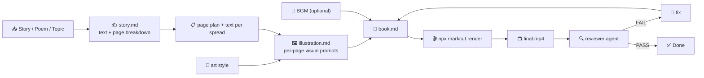

# Illustrated Book (多媒体绘本) Template

Follow this file top to bottom. Read the markcut skill (`SKILL.md` → `docs/markdown-descriptive.md`) first if you have not.



| Path | Runs in | Purpose |
|---|---|---|
| `TEMPLATE.md` | your context | everything |
| `prompts/*.md` | your context | fill-in prompts you execute |
| `agents/*.md` | separate session | subagent definitions |

## 0. Prerequisites

- `npx @lalalic/markcut` runnable
- TTS CLI (default: `edge-tts`) — narration voice, warm and expressive
- ITT CLI (for `src:auto` illustration generation) — **strongly recommended**, illustrations are the core of this format
- `ffmpeg`/`ffprobe` on PATH
- For reviewer: image-understanding capability, STT CLI

## 1. Inputs — collect before starting

| Input | Required | Default | Notes |
|---|---|---|---|
| Story / text / topic | **yes** | — | the text to illustrate. Can be: a complete story, a poem, a topic to write about, or an existing text to adapt |
| Source material | no | — | optional: URL, PDF, or existing text to adapt as picture book |
| Book type | no | `story` | `story` (narrative arc), `poetry` (verse-by-verse), `educational` (fact-based, like a nature guide), `wordless` (images only, minimal text) |
| Art style | **yes** | — | the illustration style for ALL pages. Must be consistent. Examples: "watercolor, soft pastels, children's book illustration style", "ink wash painting, traditional Chinese style", "digital painting, studio Ghibli inspired, warm lighting", "woodcut print style, high contrast black and white", "vintage botanical illustration, sepia tones". This single style string is injected into every TTI prompt. |
| Language | no | en | narration and on-screen text language |
| Reading pace | no | `moderate` | `slow` (3-4s per line, ~10s per spread), `moderate` (2-3s per line, ~7s per spread), `fast` (1.5-2s per line, ~5s per spread) |
| Voice | no | en: `en-US-JennyNeural` | edge-tts voice. Prefer warm, expressive voices for storytelling |
| BGM mood | no | `ambient` | optional background music. "soft piano", "ambient nature", "lullaby", or "none" |
| Pages | no | auto | target number of spreads/pages. Auto-calculated from text if not set |

**Style consistency rule**: The `art_style` string is THE single source of truth for illustration style. Every visual prompt across all pages must incorporate this style string. Art style inconsistency is a blocker — the reviewer checks for it.

## 2. Scene grammar — book structure

### Overview

```
# video                          ← root: width:1920 height:1080 fps:30 layout:series
│                                  subtitle:{fontSize:"40px",fontFamily:"Georgia,serif"}
│                                  tts:"<edge-tts CLI>"
│                                  transition:fade(0.5)
├── - audio isBackground:true src:bgm.mp3 volume:0.08 (optional)
│
├── ## Cover                     ← Title + author + establishing illustration
│   layout:parallel
│   - image src:auto prompt:"<cover visual, art_style>" duration:6 effect:zoomIn
│   - subtitle src:"<Title>" duration:6
│     fontSize:"64px" style:"fontWeight:bold;text-shadow:0 4px 20px rgba(0,0,0,.6)"
│   - subtitle src:"by <Author>" duration:6 start:3
│     fontSize:"32px" style:"fontStyle:italic;color:#ccc"
│   - script "<title and author, read aloud>"
│
├── ## Spread 1                  ← Story content: one spread per scene
│   layout:parallel
│   - image src:auto prompt:"<illustration for this spread, art_style>" duration:8 effect:zoomIn
│   - subtitle src:"<story text — one spread's worth>" duration:8
│     style:"position:absolute;bottom:80px;left:60px;right:60px;text-align:center;
│             text-shadow:0 2px 10px rgba(0,0,0,.5);line-height:1.6"
│   - script "<narration reading the text>"
│
├── ## Spread 2
│   ...
│
└── ## Colophon                  ← Credits, "The End", copyright
    layout:parallel
    - image src:auto prompt:"<closing visual, art_style>" duration:6 effect:fadeIn
    - subtitle src:"The End" duration:6
      fontSize:"56px" style:"fontWeight:bold;text-shadow:0 4px 20px rgba(0,0,0,.6)"
    - subtitle src:"<credits>" duration:6 start:4 fontSize:"24px" style:"color:#aaa"
    - script "<closing narration>"
```

### Timing per spread (reading pace)

| Pace | Words per spread | Duration per spread | Lines per spread |
|---|---|---|---|
| slow | 15–25 | 8–12s | 2–4 |
| moderate | 10–20 | 5–8s | 1–3 |
| fast | 8–15 | 4–6s | 1–2 |

Total duration = sum of all spread durations + cover (6s) + colophon (6s).

### Illustration effect

Each illustration should have a subtle **Ken Burns** (slow zoom or pan) effect to add life:

```markdown
- image src:auto prompt:"<prompt>" duration:8 effect:zoomIn
```

For variety, alternate between:
- `effect:zoomIn` — slow zoom into the illustration
- `effect:fadeIn` — gentle fade, good for emotional/spread transitions

Avoid fast or bouncy effects (`bounceIn`, `slideInRight`) — they break the book-like calm.

### On-screen text styling

Book text should feel like a book page, not a video caption:

```markdown
- subtitle src:"The little fox walked through the ancient forest,\nwhere the trees whispered secrets to the wind."
  duration:8
  style:"position:absolute;bottom:80px;left:60px;right:60px;text-align:center;
         font-family:'Georgia',serif;font-size:40px;line-height:1.6;
         text-shadow:0 2px 10px rgba(0,0,0,.5);color:#f5f5f7"
```

Key rules:
- `font-family`: serif (Georgia, Merriweather, Noto Serif) for book feel
- `text-align: center` for storybook elegance
- `line-height: 1.6` for readability
- Bottom-positioned to overlay the illustration without covering the main subject
- Text shadow for legibility over illustrations
- Use `\n` in subtitle text for line breaks between sentences

### Scene types (within a book)

| Scene | Purpose | Visual | Duration |
|---|---|---|---|
| Cover | Title, author, establishing illustration | main artwork | 6s |
| Spread×N | Story content, one illustration per spread | scene-specific | 5–12s each |
| Colophon | Credits, "The End" | closing artwork | 6s |

Optional additional scenes:
- **Dedication**: "For my daughter" — after cover, 3s
- **Title page**: simplified cover — after dedication, 4s
- **Half-title**: before main content — 3s

### Page count guide

| Text length | Recommended spreads | Total duration |
|---|---|---|
| Very short (poem, 20-50 words) | 3–5 | 30–60s |
| Short story (100-300 words) | 5–10 | 45–90s |
| Medium (300-600 words) | 8–15 | 60–120s |
| Long (600-1000 words) | 12–20 | 90–180s |

## 3. Authoring rules — the picture-book bar

### Illustration prompts

This is the most critical part. Every illustration prompt must:

1. **Include the art style string** verbatim. Every prompt ends with: `, {art_style}`
2. **Describe a specific scene** from the text for that spread. Don't be generic.
3. **Include composition guidance**: "wide shot", "close-up on character", "view from above"
4. **Include lighting/mood**: "warm morning light", "moonlit", "misty"
5. **Exclude text/typography** from the image prompt — text is added via the subtitle node.

Example:
```markdown
- image src:auto
  prompt:"A little red fox standing at the edge of a dark ancient forest, looking back over its shoulder, warm golden sunlight streaming through the trees, cinematic composition, watercolor, soft pastels, children's book illustration style"
  duration:8 effect:zoomIn
```

**Character consistency** (important for stories with characters):
- Describe the same character appearance across prompts: "the little red fox with a white-tipped tail"
- If the story has named characters, describe their visual appearance in the first prompt and reference it in subsequent prompts: "the same little fox, now crossing a bridge..."
- For human characters: describe age, clothing color, distinct features

### Text adaptation

- **One spread = one narrative unit**: A spread contains 1-4 sentences that form a complete story beat. Don't split a single sentence across spreads, and don't cram unrelated sentences into one spread.
- **End-of-spread hook**: Where possible, end a spread with a line that creates gentle anticipation for the next spread ("But little did she know...")
- **On-screen text**: Display ALL the text for that spread. Don't truncate or summarize. The viewer reads along as the narrator speaks.
- **Subtitle text = narration text**: They should match exactly, or the subtitle can be a slightly shorter version if the narration elaborates. If they differ, note it.

### Narration

- **Expressive reading**: Write the narration to be read expressively, not monotonously. Use punctuation for pacing: em-dashes for pauses, ellipses for suspense.
- **Pace**: Match the `reading_pace`. A moderate pace ≈ 3 words/second.
- **Voice**: Prefer warm, expressive TTS voices (JennyNeural, etc.). Avoid flat instructional voices.
- **Character voices** (optional): For dialogue-heavy stories, consider using different TTS voices per character, or add parenthetical tone guidance: `"she whispered"`, `"he boomed"`.

### BGM (optional but recommended)

```markdown
- audio isBackground:true foreground:true src:bgm.mp3 volume:0.08
```

- Volume: 0.05–0.10. The narration is the star.
- Genre: soft piano, acoustic guitar, ambient nature, lullaby, string quartet — depending on mood.
- If the story has an emotional arc, the BGM should follow it (brighter for happy scenes, softer for sad).

### Typography / subtitle style

- **Font**: serif (Georgia, Merriweather, Noto Serif) for literary feel
- **Size**: 36–44px for main text; 56–64px for title; 24–28px for credits
- **Color**: `#f5f5f7` (off-white) over dark backgrounds; `#1a1a2e` (dark) over light backgrounds
- **Position**: bottom 60–100px (lower third), centered
- **Line spacing**: `line-height: 1.6`
- **Text shadow**: always — illustrations are unpredictable in brightness

### Multi-language (variants)

- Same `# <lang>` variant block pattern.
- For translated stories, ensure the translation preserves the rhythm and pacing of the original. A line that's 8 words in English might be 12 in Chinese — adjust the spread duration accordingly.

### Frame / border effect (optional)

To reinforce the "book" feel, overlay a subtle frame or border:

```markdown
- component isBackground:true jsx:"<div style='position:absolute;inset:0;border:30px solid #2a1f14;pointer-events:none' />"
```

Or use a CSS stylesheet with a vignette:
```css
.book-frame {
  position: absolute;
  inset: 0;
  box-shadow: inset 0 0 80px rgba(0,0,0,.4);
  pointer-events: none;
}
```

## 4. Components & styles

### Optional: Ken Burns zoom component

For more controlled Ken Burns effect than `effect:zoomIn` provides:
```jsx
export function KenBurnsImage({ src, duration, zoomAmount = 1.15 }) {
  const frame = useCurrentFrame();
  const { fps } = useVideoConfig();
  const progress = frame / (duration * fps);
  const scale = 1 + (zoomAmount - 1) * Math.min(progress, 1);
  return (
    
  );
}
```

### Stylesheet (for book frame overlay)

```css
~~~css stylesheet
.book-page {
  position: absolute;
  inset: 30px;
  box-shadow: inset 0 0 60px rgba(0,0,0,.3);
  pointer-events: none;
  border: 2px solid rgba(255,255,255,.08);
  border-radius: 4px;
}
~~~
```

Then use: `- component isBackground:true jsx:"<div className='book-page' />"` at root level.

### Theme knobs

| Knob | Default | Effect |
|---|---|---|
| Font family | `Georgia, serif` | Typography feel |
| Text color | `#f5f5f7` | Legibility over illustrations |
| Frame border | `none` or `30px solid #2a1f14` | Book frame feel |
| Ken Burns zoom | `1.0`–`1.15` | Illustration animation intensity |

## 5. Workflow

### Phase 0: Text preparation

1. **Read / write the text** — Given the topic or source material, determine the text. For an existing story: read and adapt it into 1-4 sentence spreads. For a topic: write an original short story or poetic text.

2. **Determine art style** — If the user didn't provide an art style, suggest 2-3 options based on the text's mood (e.g., "watercolor, soft pastels" for a gentle story; "ink wash" for a philosophical tale; "digital painting, warm lighting" for an adventure).

### Phase 1: Page plan

3. **Split text into spreads** — Fill `prompts/story.md` with the full text and art style. This produces:
   - Per-spread text (1-4 sentences each)
   - Per-spread illustration description (what to show)
   - Total page count and estimated duration

   **Key rule**: Each spread must form a coherent narrative unit. A spread should feel complete on its own while hooking into the next.

### Phase 2: Illustration prompts

4. **Generate illustration prompts** — Fill `prompts/illustration.md` per spread. This writes the detailed TTI prompt for each illustration, ensuring:
   - The `art_style` string is appended verbatim to every prompt
   - Character descriptions stay consistent across spreads
   - Composition and lighting vary to avoid visual monotony

5. **(Optional) Generate illustrations** — If ITT CLI is available, run it for each prompt to generate the actual images. Store in `.markcut/generated/media/` with page-number filenames. If ITT is unavailable, leave `src:auto` in place — the render pipeline will resolve them.

### Phase 3: Assemble

6. **Assemble book.md** — Write the markcut markdown file using §2 grammar:
   - Root config: 1920×1080, serif subtitle font, TTS voice, optional BGM
   - Cover scene with title + author
   - Spread scenes with illustration + text + narration
   - Colophon with credits
   - Optional: dedication, title page
   - Consistent `effect:zoomIn` or `effect:fadeIn` on all illustrations

7. **Render** — `npx @lalalic/markcut render book.md`. On errors: fix and re-render, max 3 per error.

### Phase 4: Review

8. **Review (quality gate)** — Run `agents/reviewer.md` in a fresh separate session. Pass: `book.md`, rendered MP4, `TEMPLATE.md`, target duration, language, art style, book type. Returns `{verdict, findings[]}`.

9. **Fix loop** — On FAIL: fill `prompts/fix.md` with findings, edit, re-render, re-review. Max 3 iterations, then escalate.

## 6. Quality gate — exit criteria

Done only when ALL hold:

- [ ] reviewer verdict = `PASS` (zero blocker/major findings)
- [ ] total duration within ±15% of target
- [ ] structure matches §2 (cover → spreads×N → colophon)
- [ ] art style is **consistent** across ALL illustrations — spot-check 3 prompts/images, compare the style string/visual output
- [ ] character descriptions are consistent across spreads (same appearance, clothing, features)
- [ ] each spread contains 1-4 sentences that form a coherent narrative unit
- [ ] on-screen text matches narration (subtitle ≈ script) for each spread
- [ ] illustration effect is subtle (`zoomIn` or `fadeIn`) — no bouncy/fast effects
- [ ] no blank/black frames; illustrations are rendered correctly
- [ ] STT transcript matches script lines (≥90% content match)
- [ ] typography uses serif font, adequate text shadow, readable size (≥36px)
- [ ] reading pace is consistent with chosen pace (checked via average words/second across spreads)
- [ ] BGM (if present) is ducked under narration, volume ≤ 0.10
- [ ] no text/typography in the generated images (text is only in subtitle nodes)

## 7. Reference

- Golden example: See `tests/fixtures/templates/courseware.md` for the template format.
- For illustration prompts: always append ", {art_style}" to every TTI prompt.
- Effect reference: use `effect:zoomIn` (slow, default) or `effect:fadeIn` (gentle) for all illustrations.
- Subtitle styling: serif font, centered, bottom-positioned, text-shadow always set.
- Ken Burns intensity controlled via `effect:zoomIn` → the effect duration determines zoom speed.
