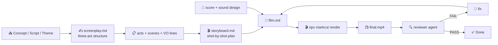

# Short Film (严肃短片) Template

Follow this file top to bottom. Read the markcut skill (`SKILL.md` → `docs/markdown-descriptive.md`) first if you have not.



| Path | Runs in | Purpose |
|---|---|---|
| `TEMPLATE.md` | your context | everything |
| `prompts/*.md` | your context | fill-in prompts you execute |
| `agents/*.md` | separate session | subagent definitions |

## 0. Prerequisites

- `npx @lalalic/markcut` runnable
- `ffmpeg`/`ffprobe`/`exiftool` on PATH
- For reviewer: image-understanding capability, STT CLI

## 1. Inputs — collect before starting

| Input | Required | Default | Notes |
|---|---|---|---|
| Concept / logline | **yes** | — | one sentence that captures the film: "A grieving musician finds an old letter that sends him on a journey across the city" |
| Source material | no | — | optional: existing short story, screenplay, article, or poem to adapt |
| Film type | no | `dramatic` | `dramatic` (narrative, characters, plot), `documentary` (real-world subject, serious tone), `mood` (atmospheric, minimal plot, sensory) |
| Tone | no | `serious` | `serious` (somber, weighty), `noir` (dark, mysterious), `melancholic` (sad, reflective), `hopeful` (bittersweet, uplifting) |
| Language | no | en | narration and on-screen text language |
| Target duration | no | 7 min | 5–10 min |
| Voice(s) | no |  | mlx-audio voice(s). For multiple characters, provide a list: {narrator, character1, character2} |
| Music mood | no | `cinematic` | score style: cinematic, ambient, noir jazz, minimal piano, tense. BGM is **recommended but not mandatory** — silence is a valid cinematic choice |
| Aspect ratio | no | `16:9` | `16:9` (standard), `2.35:1` (cinemascope — add black bars in stylesheet), `4:3` (vintage) |

**Core principle**: A serious short film is **visual storytelling first**. Every scene should advance the story through image, sound, and performance — not just narration. Voiceover is a tool, not a crutch.

## 2. Scene grammar — three-act narrative architecture

### The dramatic arc

```
# video                          ← root: width:1920 height:1080 fps:30 layout:series
│                                 
│                                  transition:fade(0.5)
├── - audio isBackground:true foreground:true src:score.mp3 volume:0.12
├── - audio isBackground:true src:ambient.mp3 volume:0.05  (optional, diegetic ambience)
│
├── ## Teaser                    ← 30–90s. Mood establisher, no context yet
│
├── ## Act 1 — The Setup         ← 90s–2min. Character, world, inciting incident
│   ├── ### Scene 1              ← establishing the world
│   ├── ### Scene 2              ← introducing the protagonist
│   └── ### Scene 3              ← the inciting incident
│
├── ## Act 2 — The Confrontation ← 3–5min. Rising action, complications
│   ├── ### Scene 4              ← reacting to inciting incident
│   ├── ### Scene 5              ← rising stakes
│   ├── ### Scene 6              ← midpoint / turning point
│   ├── ### Scene 7              ← complications, darkest moment
│   └── ### Scene 8              ← final push toward climax
│
├── ## Act 3 — The Resolution    ← 90s–2min. Climax, denouement
│   ├── ### Scene 9              ← climax
│   ├── ### Scene 10             ← falling action
│   └── ### Scene 11             ← resolution / final image
│
└── ## Epilogue                  ← 30–60s. Emotional close, title card
```

Each `### Scene` is a story beat in a specific location/time. Scenes within an act play sequentially.

### Scene structure (within each scene)

Each scene follows this shape:

```
### 1.2 — Title (INT/EXT. LOCATION - TIME)
layout:parallel
- image src:auto prompt:"<cinematic shot description>" duration:<s>
  effect:<camera move suggestion>
- script "<voiceover or dialogue line>" duration:<s>
```

The scene's `layout:parallel` means the visual and audio play simultaneously. The visual is a generated image (or video) described with cinematic language. The audio is voiceover narration, character dialogue, or ambient sound.

### Scene types

| Type | Purpose | Visual style | Duration |
|---|---|---|---|
| **Establishing** | Show location, time, mood | Wide shot, static or slow pan | 8–15s |
| **Character intro** | Introduce protagonist | Medium shot, shallow DOF | 5–10s |
| **Dialogue** | Conversation | Shot-reverse-shot or two-shot | 10–30s |
| **Action** | Movement, event | Dynamic, handheld or tracking | 5–20s |
| **Montage** | Time passing, emotional build | Series of dissolves, varied shots | 15–45s |
| **VO/internal** | Voiceover over visuals | Relevant imagery, metaphorical | 5–20s |
| **Climax** | Peak emotional moment | Intense composition, close-ups | 15–30s |
| **Resolution** | Calm after storm | Wide, soft lighting, slow | 10–20s |
| **Transition** | Bridge between acts | Metaphorical, fade to black | 3–5s |

### Timing template (7-minute film)

| Section | Scenes | Total duration | Notes |
|---|---|---|---|
| Teaser | 1 scene | 30–60s | No context, pure mood |
| Act 1 | 3 scenes | 90s | Setup + inciting incident |
| Act 2 | 4–5 scenes | 3min | Rising action + midpoint + darkest moment |
| Act 3 | 3 scenes | 90s | Climax + falling action + resolution |
| Epilogue | 1 scene | 30s | Emotional close |
| **Total** | **12–13 scenes** | **~7 min** | Adjust proportionally for 5–10 min |

For a 10-minute film, add 1–2 scenes per act. For a 5-minute film, trim 1 scene per act.

### Visual direction prompts

Every image in a short film needs cinematic shot direction. The `src:auto prompt:"..."` must include:

```
prompt:"[SHOT TYPE] of [SUBJECT], [ACTION/COMPOSITION], [LIGHTING/MOOD], [CAMERA MOVEMENT], [COLOR PALETTE], cinematic, film still, 4K"
```

| Element | Options |
|---|---|
| Shot type | wide shot, medium shot, close-up, extreme close-up, over-the-shoulder, POV, two-shot, establishing shot, aerial shot, Dutch angle |
| Camera movement | static, slow push-in, slow pull-out, tracking left, pan right, handheld, dolly zoom, crane up |
| Lighting | golden hour, moonlight, harsh noon sun, soft window light, neon glow, candlelight, low-key, high-key, chiaroscuro, silhouette |
| Color palette | warm tones, cool blues, desaturated, monochrome, teal and orange, sepia, high contrast |
| Mood | melancholic, tense, serene, foreboding, intimate, lonely, hopeful |

Example:
```markdown
- image src:auto
  prompt:"WIDE SHOT of a lone figure standing on a rain-soaked platform at dusk, train tracks vanishing into fog, soft amber light from a distant signal, static camera, desaturated cool tones, melancholic mood, cinematic, film still, 4K"
  duration:12 effect:fadeIn
```

### Camera effects

| markcut effect | Cinematic equivalent |
|---|---|
| `effect:fadeIn` | Dissolve in (soft scene open) |
| `effect:zoomIn` | Slow push-in (building tension) |
| `effect:zoomOut` | Slow pull-out (revealing context) |
| `effect:fadeIn` with long duration | Dissolve (gentle scene transition) |
| `transition:fade(1.0)` | Fade to black (act break, passage of time) |

### Transitions between scenes

Use the root-level `transition:` for standard scene-to-scene:
```markdown
# video
...
transition:fade(0.5)
```

For specific narrative transitions, use a dedicated transition scene:
```markdown
### Transition — Fade to Black
layout:parallel
- image src:auto prompt:"black frame" duration:2 effect:fadeIn
```

Or use a metaphorical transition:
```markdown
### Transition — The Passing Days
layout:parallel
- image src:auto prompt:"EXTREME CLOSE-UP of calendar pages turning in slow motion, warm window light, shallow depth of field, cinematic, film still" duration:4 effect:fadeIn
- script "Days passed. Weeks. The letter stayed in his pocket."
```

## 3. Authoring rules — the cinematic bar

### Screenplay structure

Every short film needs:

1. **A protagonist with a desire**: Someone the audience cares about who wants something. The desire drives the plot.
2. **An inciting incident**: Something that disrupts the protagonist's ordinary world and forces a choice.
3. **Rising stakes**: Each scene should make the situation more urgent or meaningful.
4. **A midpoint shift**: Halfway through, the protagonist stops reacting and starts acting.
5. **A darkest moment**: Just before the climax, all seems lost.
6. **A climax**: The peak emotional moment where the protagonist confronts the central conflict.
7. **A resolution**: The new ordinary — how the protagonist is changed.

### Narration / voiceover rules

- **Voiceover is a spice, not the main dish**. The story should be told through images. Use VO only when internal thoughts or context cannot be shown visually.
- **VO should be poetic but precise**. Short sentences. Concrete imagery. No exposition dumps.
- **One VO line per scene** (typically). Each line is 10–30 words. 2.5 words/second pace.
- **If using dialogue between characters**: Use different TTS voices per character. Mark dialogue with character names in the script:
  ```markdown
  - script "JOHN: I never thought I'd see this place again.\nMARIA: None of us did."
  ```
- **First-person** for personal stories. **Third-person** for documentary-style narration.

### Visual composition rules

- **Every image should tell a story**: A character in a frame should be doing something, feeling something. No empty landscapes unless they serve the mood.
- **Variety of shot types**: Don't use the same shot type twice in a row. Alternate wide, medium, close-up.
- **Lighting as storytelling**: A character in shadow = hiding something. Warm light = safety/memory. Cold light = reality/loss.
- **Color as meaning**: Cool palette for isolation/alienation. Warm for memory/comfort. Desaturated for despair.
- **Foreground / background**: Use depth (shallow DOF, objects in foreground) to create cinematic depth.

### Sound design

Sound is half the experience of a film. Use:

1. **Score (BGM)**: Root-level audio, `foreground:true` for ducking during VO:
   ```markdown
   - audio isBackground:true foreground:true src:score.mp3 volume:0.12
   ```
2. **Ambient sound**: Diegetic background — rain, wind, traffic, room tone:
   ```markdown
   - audio isBackground:true src:rain-ambient.mp3 volume:0.06
   ```
3. **Silence**: For the most dramatic moments, drop ALL audio. A 3–5 second silence before the climax can be more powerful than any music.

### Scene timing rhythm

A 7-minute film ≈ 420 seconds. With ~12 scenes:
- Average scene: 35 seconds
- Variation is critical: some scenes 10s (impact), some 60s (breathing room)
- Act 2 is the longest and should have the widest variation
- Silence / slow scenes feel longer — use them sparingly

### Multi-language (variants)

- Same `# <lang>` variant block pattern.
- For translated films: dialogue and VO must preserve the dramatic timing. A line that takes 3s in English should take ~3s in the translation.

## 4. Components & styles

### Optional: Letterbox / Cinemascope overlay

```css
~~~css stylesheet
.letterbox {
  position: absolute;
  left: 0; right: 0;
  height: 120px;  /* for 2.35:1 on 16:9 canvas */
  background: #000;
  pointer-events: none;
}
.letterbox-top { top: 0; }
.letterbox-bottom { bottom: 0; }
~~~
```

```markdown
- component isBackground:true jsx:"<div className='letterbox letterbox-top' />"
- component isBackground:true jsx:"<div className='letterbox letterbox-bottom' />"
```

### Optional: Subtitle styling for film

```markdown
# video
... subtitle:{fontSize:"28px",fontFamily:"'Courier New',monospace",style:"text-align:center;text-shadow:0 2px 8px rgba(0,0,0,.8)"}
```

### Title card component

```jsx
export function TitleCard({ title, subtitle = '' }) {
  return (
    <div style={{
      width: '100%', height: '100%',
      display: 'flex', flexDirection: 'column',
      alignItems: 'center', justifyContent: 'center',
      background: '#0a0a0a',
      fontFamily: "'Georgia', serif",
    }}>
      <div style={{ fontSize: 64, color: '#f5f5f7', letterSpacing: 4, marginBottom: 20, textAlign: 'center', padding: '0 40px' }}>
        {title}
      </div>
      {subtitle && (
        <div style={{ fontSize: 24, color: '#888', fontStyle: 'italic', letterSpacing: 2 }}>
          {subtitle}
        </div>
      )}
    </div>
  )
}
```

### Theme knobs

| Knob | Default | Effect |
|---|---|---|
| Letterbox height | `0` (none) | `120px` for 2.35:1 cinemascope |
| Subtitle font | `'Courier New', monospace` | Film subtitle aesthetic |
| Score volume | `0.12` | Music presence in mix |
| Transition duration | `0.5s` | Scene-to-scene fade speed |

## 5. Workflow

### Phase 0: Concept

1. **Define the story** — Given the concept/logline, develop:
   - Protagonist: who, what do they want, what's in their way
   - Logline expanded into 3-sentence synopsis (beginning, middle, end)
   - Tone and visual references (films, photographers, color palettes)
   - VO/narration approach: first-person or third-person, how much

### Phase 1: Screenplay

2. **Write the screenplay** — Fill `prompts/screenplay.md` with the concept. This produces:
   - Three-act structure with scene-by-scene breakdown
   - Per-scene: location, time, shot type, VO/dialogue, mood, duration
   - Visual references for each scene

   The output is a narrative plan, not a technical markcut document.

### Phase 2: Storyboard

3. **Develop shot-by-shot** — For each scene from the screenplay, fill `prompts/storyboard.md`:
   - Detailed TTI prompt with shot type, lighting, mood, camera movement, color
   - VO/dialogue text for the scene
   - Duration and effect
   - Sound notes (score, ambient, silence)

4. **Generate visuals** — Run ITT CLI for each scene's prompt. Store as `scene-01.jpg`, `scene-02.jpg`, etc. in `.markcut/generated/media/`.

### Phase 3: Assemble

5. **Assemble film.md** — Write the markcut markdown file using §2 grammar:
   - Root config with TTS voice, optional subtitles
   - BGM/ambient audio at root level
   - Teaser → Act 1 → Act 2 → Act 3 → Epilogue
   - Each scene with cinematic image + VO/dialogue
   - Transitions between acts (fade to black, metaphorical)
   - Title card at start, credits at end

6. **Render** — `npx @lalalic/markcut render film.md`. On errors: fix and re-render, max 3 per error.

### Phase 4: Review

7. **Review (quality gate)** — Run `agents/reviewer.md` in a fresh separate session. Pass: `film.md`, rendered MP4, `TEMPLATE.md`, target duration, language, tone, film type. Returns `{verdict, findings[]}`.

8. **Fix loop** — On FAIL: fill `prompts/fix.md` with findings, edit, re-render, re-review. Max 3 iterations, then escalate.

## 6. Quality gate — exit criteria

Done only when ALL hold:

- [ ] reviewer verdict = `PASS` (zero blocker/major findings)
- [ ] total duration within ±15% of target
- [ ] structure matches §2 (teaser → act 1 → act 2 → act 3 → epilogue)
- [ ] protagonist has a clear desire, inciting incident is present, stakes rise through the film
- [ ] voiceover is minimal — the story is told through images first, VO second
- [ ] at least 2 shot type transitions in every 3 consecutive scenes (not all wide, not all close-up)
- [ ] lighting/mood is intentional and consistent within scenes (spot-check 3: does the image match the described tone?)
- [ ] no blank/black frames; all `src:auto` images rendered with cinematic quality
- [ ] STT transcript matches script lines (≥85% content match)
- [ ] BGM (if present) ducked under VO, volume 0.08–0.15
- [ ] ambient sound (if present) present at low volume (≤0.06)
- [ ] scene duration variation: at least 2 scenes under 15s AND at least 2 scenes over 40s
- [ ] transitions between acts are marked (fade to black, transition scene, or clear narrative break)
- [ ] audio is not uniformly present — at least one moment of silence or near-silence (≤3s of quiet) for dramatic effect
- [ ] visual prompts include shot type, camera movement, lighting, and color palette (spot-check 3)

## 7. Reference

- Golden example: See `tests/fixtures/templates/courseware.md` for the template format.
- Screenplay structure: Save the Cat (Blake Snyder) or The Hero's Journey (Joseph Campbell) for scene-by-scene planning.
- Shot types: See §2 visual direction prompts for the full taxonomy of cinematic shots.
- Sound design principle: For every minute of film, have at least 5 seconds of silence or near-silence.
- Effect reference: `fadeIn` (dissolve), `zoomIn` (push-in), `zoomOut` (pull-out), `transition:fade(T)` (scene transition).
