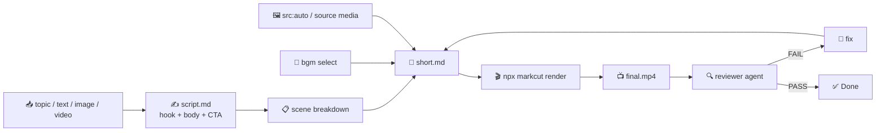

# Short Video Template

Follow this file top to bottom. Read the markcut skill (`SKILL.md` → `docs/markdown-descriptive.md`) first if you have not.



| Path | Runs in | Purpose |
|---|---|---|
| `TEMPLATE.md` | your context | everything |
| `prompts/*.md` | your context | fill-in prompts you execute |
| `agents/*.md` | separate session | subagent definitions |

## 0. Prerequisites

- `npx @lalalic/markcut` runnable
- `ffmpeg`/`ffprobe` on PATH
- ITT/TTV CLI (for `src:auto` background generation) — optional but recommended
- For reviewer: image-understanding capability, STT CLI

## 1. Inputs — collect before starting

| Input | Required | Default | Notes |
|---|---|---|---|
| Topic / source material | **yes** | — | a topic to explain, a quote, an article, a story, or a URL to summarize |
| Source media | no | — | optional: image file path, video file path, or folder of media to turn into a short |
| Format | no | `explainer` | `explainer` (topic→text), `quote` (quote+background), `showcase` (image→narrated), `highlight` (video→best moments), `storytime` (short story) |
| Language | no | en | narration language |
| Style | no | `cinematic` | `cinematic` (dramatic), `energetic` (fast cuts, bright), `minimal` (clean, slow), `trendy` (meme-aware, casual) |
| Target duration | no | 30s | 15–60s |
| Voice | no |  | mlx-audio voice |
| BGM mood | no | `upbeat` | mood for background music. BGM is **mandatory**. |

**Rule:** For explainer/quote/storytime formats, generate all visuals via `src:auto prompt:"..."` — describe vivid, cinematic scenes. For showcase/highlight formats, use the provided source media and let the narration describe it.

## 2. Scene grammar — mandatory structure

### Overview

```
# video                          ← root: width:1080 height:1920 fps:30 layout:series
│                                  subtitle:{fontSize:"56px",type:"Typewriter",fontFamily:"Arial Black"}
│                                  
│                                  transition:fade(0.3)
├── - audio isBackground:true foreground:true src:bgm.mp3 volume:0.1
│
├── ## Hook                      ← 1–3s, FIRST FRAME HOOKS THE VIEWER
│   layout:parallel
│   - image/video src:auto prompt:"<arresting visual>" effect:zoomIn
│   - subtitle src:"<hook line — one punchy sentence>" duration:3 type:Bounce
│   - script "<hook narration>" (optional)
│
├── ## Body1                     ← each body scene = one key point
│   layout:parallel
│   - image/video src:auto prompt:"<scene visual>" effect:slideInRight
│   - subtitle src:"<key point — short, scannable>" duration:5 type:Typewriter
│   - script "<narration for this point>"
│
├── ## Body2                     ← 3–7 body scenes total
│   ...                          ← each 3–8 seconds, fast-paced
│
└── ## CTA                       ← 3–5s, call to action
    layout:parallel
    - image/video src:auto prompt:"<closing visual>" effect:zoomIn
    - subtitle src:"<CTA — like/subscribe/follow>" duration:4 type:Bounce
    - script "<final words>"
```

### The Hook rule — first 2 seconds decide everything

The hook is **the most important part of a short video**. If it doesn't grab attention in the first 2 seconds, the viewer scrolls past. Rules:

- **Hook line**: one short, punchy sentence that creates curiosity, surprise, or emotional connection. Use questions ("Ever wondered why..."), bold claims ("Most people get this wrong"), or intriguing statements ("I tried X for 30 days.").
- **Hook visual**: arresting, high-impact image/video that matches the hook line. Use `effect:zoomIn` for dramatic entrance.
- **Hook duration**: 1–3 seconds max. Get to the content fast.
- **No slow fade-ins, no logo animations, no intro music swell** — straight into the hook.

### Body scenes — rapid, scannable

- **3–7 body scenes**, each 3–8 seconds. Total body duration = target − hook − CTA.
- **One key point per scene**. A single idea, fact, step, or argument.
- **Text overlay (`subtitle`) is the star**: short, scannable, large font (48–64px). Use `type:Typewriter` or `type:Fade` for animated entrance.
- **Visual background**: full-screen image/video that's relevant, cinematic, or metaphorical. Use `effect:slideInRight` or `effect:zoomIn` for scene transitions.
- **Narration (`script`)**: optional but recommended. If used, keep it tight (5–15 words per scene). The subtitle text and narration should match closely but the subtitle is more scannable (shorter).

### CTA scene

- 3–5 seconds.
- Clear call to action: "Follow for more", "Like if you agree", "Share this with someone who needs to hear it".
- Visual: inviting, positive, or memorable.
- Subtitle: `type:Bounce` for energetic CTA.

### Scene timing template

| Scene | Duration | Subtitle type | Effect | Visual |
|---|---|---|---|---|
| Hook | 1–3s | `Bounce` | `zoomIn` | arresting, high-impact |
| Body×N | 3–8s each | `Typewriter` or `Fade` | `slideInRight` | scene-relevant, cinematic |
| CTA | 3–5s | `Bounce` | `zoomIn` | closing, positive |

## 3. Authoring rules — the short-form bar

### Script writing

- **Hook script**: 5–15 words. One sentence. Creates curiosity. No filler.
- **Body scripts**: 5–15 words per scene. One idea per scene. Conversational, punchy.
- **Total words**: target duration × 3 words/second (shorter-than-speech pace). A 30s video ≈ 90 words total.
- **No introductions**: no "today I'm going to tell you about..." Get into the content immediately.
- **Voice**: match the style. Cinematic = authoritative, confident. Energetic = fast, excited. Minimal = calm, slow. Trendy = casual, relatable.

### Subtitle / caption text

- **Subtitle is separate from script**: subtitle text is what appears on screen (scannable, shorter). Script is what TTS speaks (can be slightly longer). They should convey the same idea.
- **Font size**: 48–64px. Short videos are watched on mobile — text must be large and legible.
- **Max 10 words per subtitle frame**. If a script has more words, split into multiple subtitle scenes or keep the subtitle terse and let the script elaborate.
- **Animated caption types**: `Typewriter` for reveal (most popular), `Bounce` for emphasis (hook, CTA), `Fade` for transitions, `Colorful` for energetic/fun content.
- **Position**: subtitles auto-center by default. For safety (not covering faces), use `style:bottom:20%` on the subtitle node to push captions to the lower third.

### Visuals (images/video backgrounds)

- **Explainers & quotes**: use `src:auto prompt:"<vivid scene description>"` to generate backgrounds. Describe the mood, lighting, and composition (e.g., "cinematic shot of a library at twilight, warm lighting, shallow depth of field").
- **Showcase**: use the source image as the background. If it's not full-screen, add a dark gradient overlay or blur.
- **Highlights**: use trimmed segments from the source video as background, with overlay text.
- **Consistent aesthetic**: all scenes should feel like they belong together — similar color palette, lighting, or style. Specify this in prompts (e.g., "consistent cinematic style, warm tones").
- **Text legibility**: ensure the background has enough contrast with the subtitle text. If the background is bright, use dark subtitle text or add a semi-transparent overlay.

### BGM — mandatory

Always add a root-level audio node:
```markdown
- audio isBackground:true foreground:true src:bgm.mp3 volume:0.1
```

Choose BGM that matches the style:
- Cinematic: ambient, orchestral pads, tension builders
- Energetic: upbeat electronic, lo-fi beats, pop
- Minimal: soft piano, field recordings, sparse ambient
- Trendy: viral audio snippets, trending beats

Volume: 0.08–0.15 (lower than vlog BGM — short video TTS should be very clear).

### Effects

- **Hook**: `effect:zoomIn` — dramatic entrance
- **Body**: `effect:slideInRight` — forward momentum
- **Body transitions**: `effect:fadeIn` for calm scenes
- **Key visual reveal**: `effect:bounceIn` for emphasis
- **CTA**: `effect:zoomIn` or `effect:bounceIn`

### Style-specific rules

| Style | Pace | Voice | Visuals | BGM |
|---|---|---|---|---|
| **cinematic** | 4–7s per scene | authoritative, deep | dramatic lighting, nature, architecture | orchestral, ambient |
| **energetic** | 2–4s per scene | fast, excited, high energy | bright colors, motion blur, urban | upbeat electronic, pop |
| **minimal** | 5–8s per scene | calm, slow, thoughtful | clean backgrounds, negative space | soft piano, sparse |
| **trendy** | 2–5s per scene | casual, relatable, meme-aware | dynamic, text-heavy, greenscreen | viral audio, trending |

### Multi-language (variants)

- Same pattern as courseware: `# <lang>` variant block at file end with per-language TTS voice.
- Subtitle text and script both need `<lang>:"..."` twins.

### Format-specific structure

| Format | Hook angle | Body structure | Visual style |
|---|---|---|---|
| **explainer** | "Most people don't know..." | 3–7 facts/steps | metaphorical/abstract backgrounds |
| **quote** | "This quote changed how I think..." | 1 scene: the quote. Optional: context | minimal, text-focused |
| **showcase** | "Look at this..." | 3–5 scenes describing aspects of the image | the image itself, zoom/pan details |
| **highlight** | "The best part was..." | 3–5 key moments from the source | trimmed video segments |
| **storytime** | "So this happened..." | 3–5 story beats | atmospheric, story-relevant |

## 4. Components & styles

Short videos use markcut's built-in nodes: `image`, `video`, `audio`, `subtitle`, `script`, `effect`. No custom JSX components are required.

### Subtitle configuration (root config line)

```markdown
# video
width:1080 height:1920 fps:30 layout:series
subtitle:{fontSize:"56px",type:"Typewriter",fontFamily:"Arial Black,Impact"}
```

The subtitle config sets defaults. Per-scene overrides are done via `style:` on the subtitle node.

### Per-scene subtitle override example

For a hook scene that needs a bigger, bouncy caption:
```markdown
- subtitle src:"THIS WILL BLOW YOUR MIND" duration:3 type:Bounce
  fontSize:"72px" style:"color:#ff6b6b;text-shadow:0 4px 20px rgba(0,0,0,.8)"
```

### Dark overlay (for text legibility on bright backgrounds)

If the background image is bright, add a gradient overlay using an image with `mix-blend-mode`:
```markdown
- image isBackground:true src:gradient-overlay.png
  style:position:absolute;inset:0;width:100%;height:100%;object-fit:fill
```

Generate a linear-gradient PNG during assembly, or use a CSS gradient in the stylesheet.

### Stylesheet (optional — add if gradients needed)

If you want a built-in dark overlay without a separate image:
```css
~~~css stylesheet
.overlay {
  position: absolute;
  inset: 0;
  background: linear-gradient(180deg, rgba(0,0,0,.1) 0%, rgba(0,0,0,.6) 100%);
  pointer-events: none;
}
~~~
```

Then use `- component isBackground:true jsx:"<div className='overlay' />"` at root level.

## 5. Workflow

### Phase 0: Understand input

1. **Determine input type** — Is the source a topic/text, an image, a video, or a URL? Read/analyze the source material. For URLs or articles, extract the core message. For images, understand what it shows. For videos, extract key moments or transcribe with STT.

2. **Collect inputs** — Fill §1 inputs table from user conversation. Determine format (explainer/quote/showcase/highlight/storytime) and style (cinematic/energetic/minimal/trendy).

### Phase 1: Script

3. **Write the script** — Fill `prompts/script.md` with the topic, format, and style. This produces a timed scene breakdown:
   - Hook line + visual idea
   - Body: 3–7 key points, each with subtitle text + narration + visual prompt
   - CTA line + visual idea
   - Total word count within target duration

   **Review the script**: does the hook grab? Is it scannable? Does each scene have one clear idea?

### Phase 2: Storyboard

4. **Generate backgrounds** — For scenes using `src:auto`, run the ITT/TTV CLI for each prompt. For source-media formats (showcase/highlight), extract or prepare the source visuals:
   - Showcase: source image as-is
   - Highlight: trim source video segments using `startFrom`/`endAt`

5. **Assemble short.md** — Write the markcut markdown file using §2 grammar. Root config: 1080×1920, `subtitle:{"fontSize":"56px"}`, TTS voice. BGM at root level. Each scene: background media + subtitle + optional script.

### Phase 3: Render & Review

6. **Render** — `npx @lalalic/markcut render short.md`. On errors: fix and re-render, max 3 attempts per error, then ask.

7. **Review (quality gate)** — Run `agents/reviewer.md` in a fresh separate session. Pass: `short.md`, rendered MP4, `TEMPLATE.md`, target duration, language, format, style. Returns `{verdict, findings[]}`.

8. **Fix loop** — On FAIL: fill `prompts/fix.md` with findings, edit, re-render, re-review. Max 3 iterations, then escalate.

## 6. Quality gate — exit criteria

Done only when ALL hold:

- [ ] reviewer verdict = `PASS` (zero blocker/major findings)
- [ ] total duration within ±15% of target
- [ ] structure matches §2 (hook → body×N → CTA)
- [ ] hook ≤ 3 seconds and creates curiosity/surprise (reviewer checks first frame + first subtitle)
- [ ] no blank/black frames; all `src:auto` prompts generated usable media
- [ ] STT transcript matches script lines (≥90% content match)
- [ ] subtitle text is scannable (≤10 words per scene, ≥48px readable at 1080p)
- [ ] BGM present, ducked under voice (TTS clearly audible over music)
- [ ] total scene count 5–9 (1 hook + 3–7 body + 1 CTA)
- [ ] effects applied: hook has `effect:zoomIn` or equivalent, body scenes have entrance transitions
- [ ] format-specific check:
  - explainer: every body scene teaches one distinct point
  - quote: subtitle shows the quote text, script provides context
  - showcase: source image is visible and well-framed
  - highlight: source video segments play correctly with startFrom/endAt
  - storytime: narrative arc with clear beginning, middle, end

## 7. Reference

- Golden example: See `tests/fixtures/templates/courseware.md` for the template format.
- Markcut subtitle types: `docs/markdown-descriptive.md` §§ "Subtitle" and "Caption animations" for all available `type:` values.
- Effects reference: `docs/markdown-descriptive.md` for `effect:` values (`fadeIn`, `zoomIn`, `bounceIn`, `slideInLeft`, `slideInRight`, `flipIn`).
